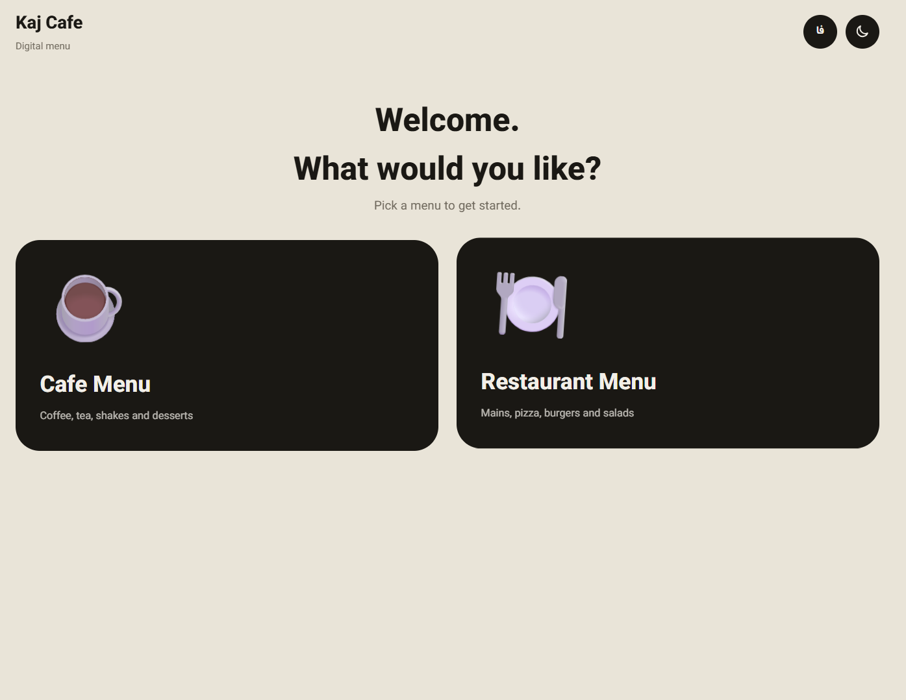
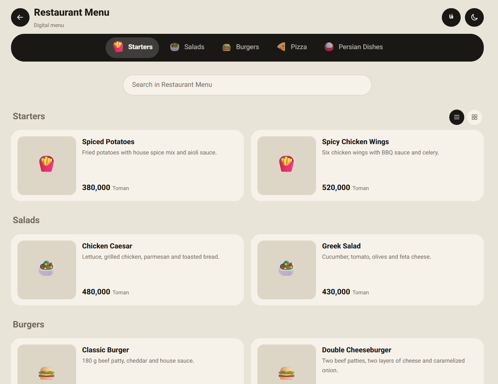
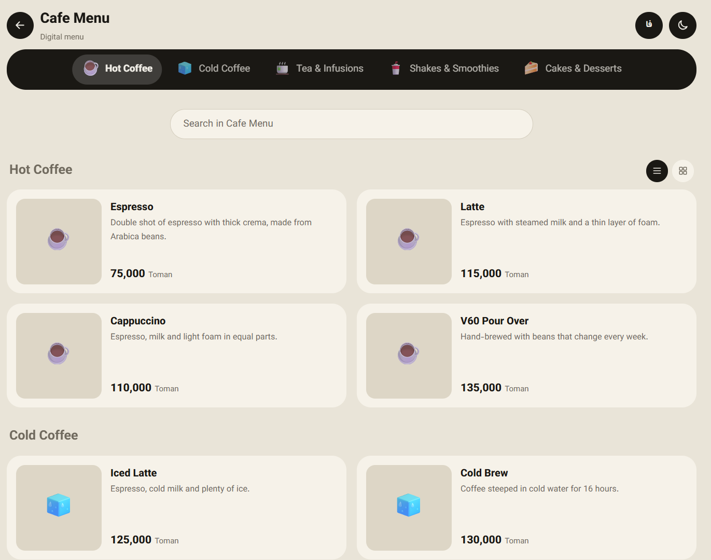
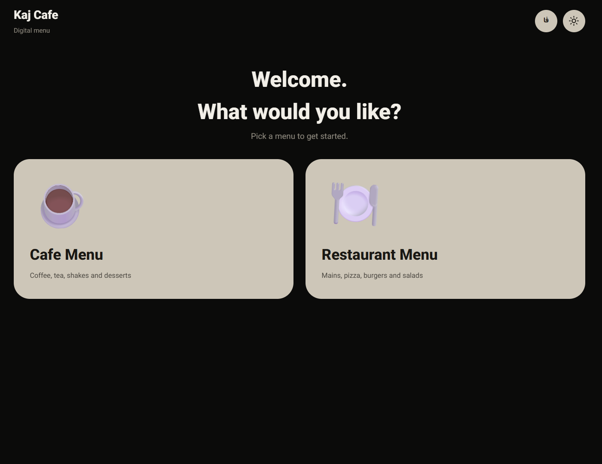
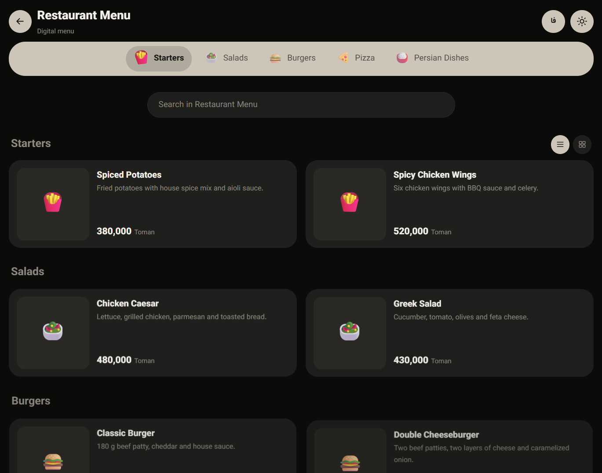
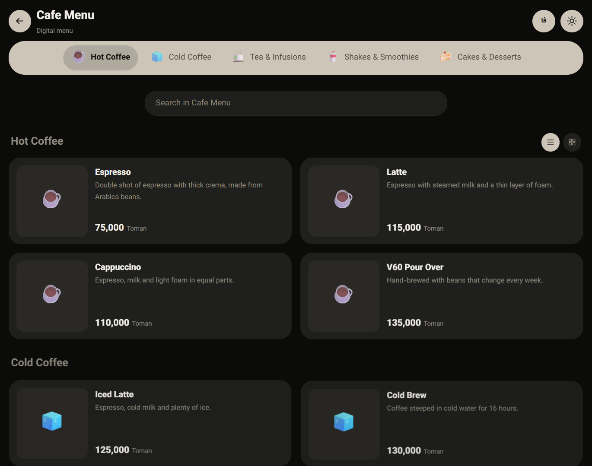

[فارسی](README.md) | **English**

# Digital Menu for Cafés and Restaurants

A mobile-first digital menu built with **Django**. Guests scan the QR code on their table, pick the café or restaurant menu, and browse items with photos, descriptions and prices. Staff manage everything from a Persian-language admin panel.


<!-- After deploying, enable this line and add your URL:
**[Live demo](https://your-demo-url)**
-->

## Preview

<table>
  <tr>
    <td align="center"><br><sub>Menu chooser</sub></td>
    <td align="center"><br><sub>restaurant Dark theme</sub></td>
    <td align="center"><br><sub>Cafe Light theme</sub></td>
  </tr>
</table>

<table>
  <tr>
    <td align="center"><br><sub>Menu chooser</sub></td>
    <td align="center"><br><sub>Restaurant Dark theme</sub></td>
    <td align="center"><br><sub>Cafe Light theme</sub></td>
  </tr>
</table>


## Why this project

Printed menus have to be reprinted whenever a price or item changes, and they can't show photos or descriptions. This project gives the experience modern cafés offer: scan a QR code, get a fast menu on your phone, and let staff update prices and items in seconds.

## Features

**For guests**

- Guest flow: **choose language → choose menu (café, restaurant, or any you add) → browse items**
- Sticky category bar that follows the scroll position
- Instant search across item names and descriptions
- List or grid view (the choice is remembered)
- Item detail sheet with photo, description and price
- Light and dark themes with a switch; defaults to the device setting
- **Bilingual (Persian and English)** with a language switch; page direction (RTL or LTR) and price format change automatically
- Table number from the QR link (e.g. "Table 5")
- Prices shown with Persian digits and thousands separators
- Entrance, scroll and theme-switch animations, automatically disabled when the device requests reduced motion

**For staff**

- Persian-language admin for menus, categories and items
- Photo upload per item
- English fields for the name and description of every menu, category and item (falls back to Persian when empty)
- Quick edits to price, order and availability straight from the item list
- QR image generation per menu and per table

## Tech stack

| Area | Tools |
| --- | --- |
| Backend | Python, Django 5, SQLite |
| Frontend | Plain HTML, CSS and JavaScript (no framework) |
| Images and QR | Pillow, qrcode |
| Font | Vazirmatn |

## Quick start

Requires Python 3.10 or newer.

```bash
git clone https://github.com/USERNAME/cafe-menu.git
cd cafe-menu

python3 -m venv venv
source venv/bin/activate          # Windows: venv\Scripts\activate

pip install -r requirements.txt
python manage.py makemigrations menu
python manage.py migrate
python manage.py seed_demo         # optional demo menus with English translations
python manage.py createsuperuser
python manage.py runserver
```

## Item photos

Upload a photo per item from the admin (Items section). Without a photo, the category emoji is shown.

Every uploaded photo is automatically turned into a **square 800×800 JPEG** so all cards look consistent. To normalize existing photos: `python manage.py normalize_images`

To quickly fill the demo items:

```bash
export PEXELS_API_KEY=your_key     # optional, free key at pexels.com/api
python manage.py fetch_images
```

Set `IMAGE_STYLE` to add one consistent style to every search (e.g. `export IMAGE_STYLE="top view dark background"`). With a Pexels key the photos are more relevant; without one it falls back to Flickr. Only items without a photo are filled; use `--force` to replace all.

## QR codes

```text
/qr/                 QR for the start page (language and menu choice); recommended for tables
/qr/?table=5         same QR for table 5
/qr/cafe/            QR image that opens the café menu directly
/qr/restaurant/      QR image for the restaurant menu
/qr/cafe/?table=5    QR for the café menu, table 5
```

`cafe` and `restaurant` are each menu's slug in the admin. The QR encodes the host you opened it with, so generate the final one on your real domain before printing.

## Project structure

```text
config/                      settings and root URLs
menu/
├── models.py                Menu, Category, Item
├── admin.py                 Persian admin
├── views.py                 landing, menu page, QR generation
├── i18n.py                  fixed UI strings in Persian and English
├── templatetags/            digits, price and content translation
├── management/commands/     seed_demo and fetch_images
├── templates/menu/          base, home, menu
└── static/menu/             style.css and app.js
docs/screenshots/            README preview images
```

## Design and technical decisions

- **Mobile-first:** designed for phones first, then enhanced for larger screens, since most guests scan with a phone.
- **Theme via CSS variables:** all colors live in one block at the top of `style.css`. The saved theme is applied before first paint to avoid a flash.
- **Progressive enhancement:** content is server-rendered and readable without JavaScript. JavaScript only adds search, animation and the detail sheet.
- **Accessibility:** native `<dialog>`, `aria-label` on icon buttons, visible focus outlines, and `prefers-reduced-motion` support.
- **Simple, dependency-free i18n:** fixed UI strings live in `menu/i18n.py` and content translations in the models' `*_en` fields. The chosen language is stored in a cookie. Larger projects can switch to Django's own gettext system.
- **Content safety:** item text is inserted into the detail sheet with `textContent`, not `innerHTML`.
- **Modern-browser animations:** the circular theme reveal and page transitions use the View Transitions API. Older browsers simply skip the animation and everything still works.

## Customization

- Café name: `CAFE_NAME` and `CAFE_NAME_EN` in `config/settings.py`
- Default language: `DEFAULT_LANG` in `config/settings.py`
- Colors: top of `menu/static/menu/css/style.css`
- New menus, categories and items: from the admin

## Deployment

Set these before going live:

```bash
export DJANGO_DEBUG=0
export DJANGO_SECRET_KEY=a-long-random-key
export DJANGO_ALLOWED_HOSTS=yourdomain.com
python manage.py collectstatic
```

With `DEBUG=0` your web server must serve the `media/` folder. For better speed and reliability, self-host the Vazirmatn font instead of loading it from Google Fonts.

## Ideas for next steps

- Order cart and sending orders to the kitchen
- Multi-language support (Persian and English)
- Item badges such as "Chef's pick", "New" and "Spicy"
- Automated tests and GitHub Actions
- Docker for easier setup

## Credits

- [Vazirmatn](https://github.com/rastikerdar/vazirmatn) font, OFL licensed
- Demo photos (if you use `fetch_images`) come from [Pexels](https://www.pexels.com) or Flickr; each photo belongs to its owner.

## License

Released under the MIT License. See [LICENSE](LICENSE).

## Author

**Amir Mohammad Omranpour**, web designer and developer (Django, JavaScript, HTML, CSS)

<!-- Add your GitHub, LinkedIn or email link here -->
