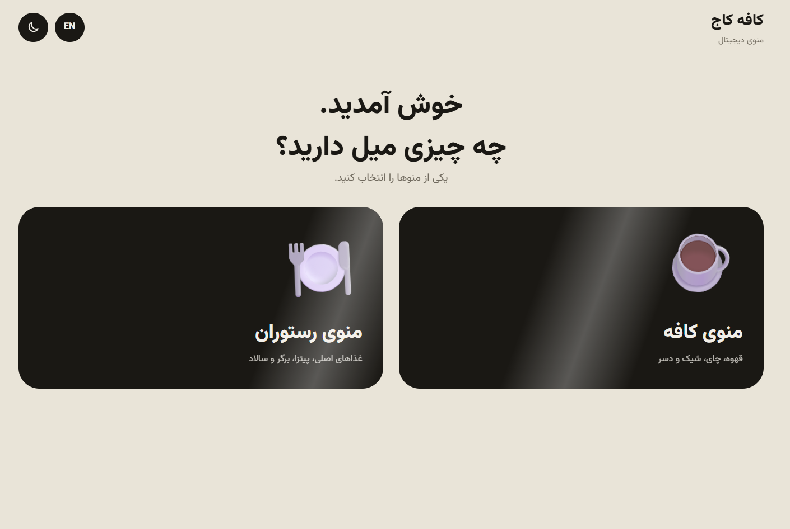
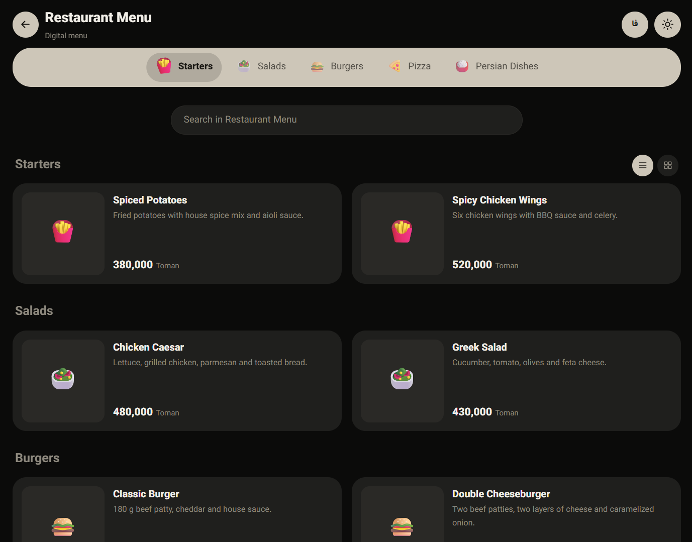
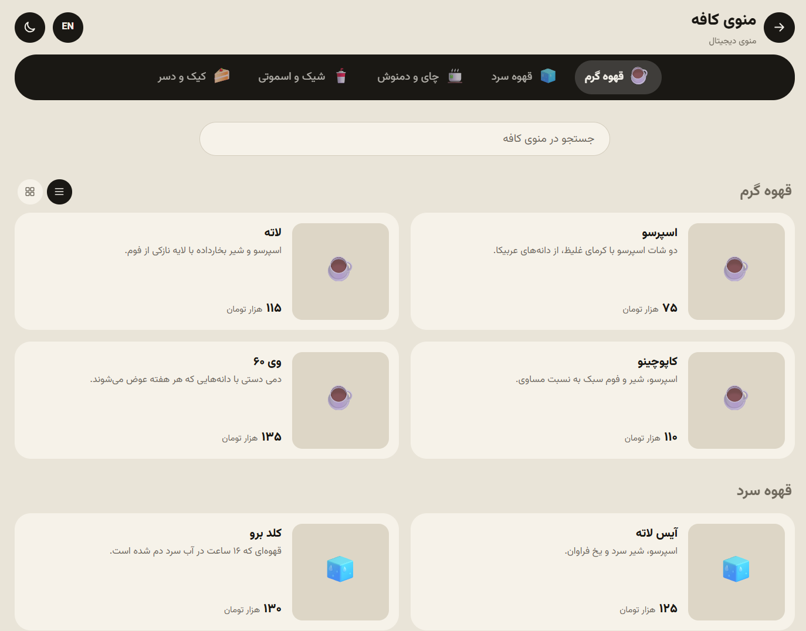
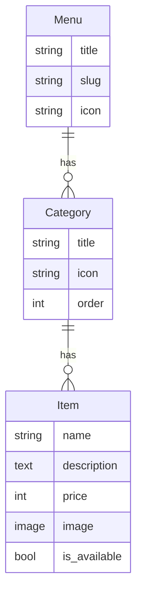

<div dir="rtl">

[English](README.en.md) | **فارسی**

# منوی دیجیتال کافه و رستوران

منوی دیجیتال موبایل‌محور با **Django**. مشتری QR کد روی میز را اسکن می‌کند، بین منوی کافه و رستوران انتخاب می‌کند و آیتم‌ها را با عکس، توضیح و قیمت می‌بیند. صاحب کافه همه‌چیز را از یک پنل ادمین فارسی مدیریت می‌کند.


<!-- بعد از دیپلوی، این خط را فعال کنید و آدرس را بگذارید:
**[مشاهده دمو آنلاین](https://your-demo-url)**
-->

## پیش‌نمایش

<table>
  <tr>
    <td align="center"><br><sub>انتخاب منو</sub></td>
    <td align="center"><br><sub>تم تاریک</sub></td>
    <td align="center"><br><sub>تم روشن</sub></td>
  </tr>
</table>


## چرا این پروژه؟

منوی کاغذی هر بار که قیمت یا آیتمی عوض می‌شود باید دوباره چاپ شود و عکس و توضیح هم ندارد. این پروژه همان تجربه‌ای را می‌دهد که کافه‌های امروزی دارند: اسکن QR، منوی سریع روی گوشی و تغییر قیمت و آیتم در چند ثانیه از پنل ادمین.

## امکانات

**برای مشتری**

- مسیر کاربر: **انتخاب زبان ← انتخاب منو (کافه، رستوران یا هر منوی دیگر) ← آیتم‌ها**
- نوار دسته‌بندی چسبان که با اسکرول خودکار روی دسته فعلی می‌رود
- جستجوی لحظه‌ای در نام و توضیح آیتم‌ها
- نمایش لیستی یا شبکه‌ای (انتخاب کاربر ذخیره می‌شود)
- پنل جزئیات هر آیتم با عکس، توضیح و قیمت
- تم روشن و تاریک با دکمه تغییر؛ پیش‌فرض از تنظیم گوشی پیروی می‌کند
- **دو زبانه (فارسی و انگلیسی)** با دکمه تغییر زبان؛ جهت صفحه (راست‌به‌چپ یا چپ‌به‌راست) و قالب قیمت خودکار عوض می‌شود
- نمایش شماره میز از روی QR (مثلاً «میز ۵»)
- قیمت‌ها با ارقام فارسی و جداکننده هزارگان
- انیمیشن‌های ورود، اسکرول و تغییر تم؛ در حالت «کاهش حرکت» دستگاه خودکار خاموش می‌شوند

**برای مدیر کافه**

- پنل ادمین فارسی برای مدیریت منوها، دسته‌بندی‌ها و آیتم‌ها
- آپلود عکس برای هر آیتم
- فیلدهای انگلیسی برای نام و توضیح هر منو، دسته‌بندی و آیتم (اگر خالی بماند، متن فارسی نشان داده می‌شود)
- تغییر سریع قیمت، ترتیب و «موجود است» مستقیم از لیست آیتم‌ها
- ساخت عکس QR برای هر منو و هر میز

## تکنولوژی‌ها

| بخش | ابزار |
| --- | --- |
| بک‌اند | Python، Django 5، SQLite |
| فرانت‌اند | HTML، CSS و JavaScript خالص (بدون فریم‌ورک) |
| عکس و QR | Pillow، qrcode |
| فونت | Vazirmatn |

## شروع سریع

پیش‌نیاز: Python 3.10 یا بالاتر.

```bash
git clone https://github.com/USERNAME/cafe-menu.git
cd cafe-menu

python3 -m venv venv
source venv/bin/activate          # ویندوز: venv\Scripts\activate

pip install -r requirements.txt
python manage.py makemigrations menu
python manage.py migrate
python manage.py seed_demo         # منوهای نمونه با ترجمه انگلیسی (اختیاری)
python manage.py createsuperuser   # ساخت کاربر ادمین
python manage.py runserver
```

- سایت: http://127.0.0.1:8000/
- پنل ادمین: http://127.0.0.1:8000/admin/

**تست روی گوشی:** سرور را با `python manage.py runserver 0.0.0.0:8000` اجرا کنید، گوشی و کامپیوتر را به یک وای‌فای وصل کنید و `http://IP-کامپیوتر:8000` را در گوشی باز کنید.

## عکس آیتم‌ها

از پنل ادمین، بخش «آیتم‌ها»، برای هر آیتم عکس آپلود کنید. بدون عکس، ایموجی دسته‌بندی نمایش داده می‌شود.

هر عکسی که آپلود شود خودکار **مربعی ۸۰۰×۸۰۰ و JPEG** می‌شود تا همه کارت‌ها یکدست باشند. برای یکدست کردن عکس‌های قدیمی: `python manage.py normalize_images`

برای پر کردن سریع آیتم‌های نمونه:

```bash
export PEXELS_API_KEY=your_key     # اختیاری، کلید رایگان از pexels.com/api
python manage.py fetch_images
```

با `IMAGE_STYLE` می‌توانید یک سبک ثابت به همه جستجوها اضافه کنید (مثلاً `export IMAGE_STYLE="top view dark background"`). با کلید Pexels عکس‌ها مرتبط‌تر هستند؛ بدون کلید از Flickr دانلود می‌شود. فقط آیتم‌های بدون عکس پر می‌شوند و با `--force` همه عوض می‌شوند.

## QR کد

```text
/qr/                 QR صفحه اول (انتخاب زبان و منو)؛ پیشنهادی برای میزها
/qr/?table=5         همان QR برای میز ۵
/qr/cafe/            عکس QR مستقیم منوی کافه
/qr/restaurant/      عکس QR منوی رستوران
/qr/cafe/?table=5    QR منوی کافه برای میز ۵
```

`cafe` و `restaurant` همان «آدرس (انگلیسی)» هر منو در ادمین است. QR با همان دامنه‌ای ساخته می‌شود که با آن باز کرده‌اید، پس برای چاپ نهایی آن را روی دامنه اصلی بسازید.

## مدل داده



قیمت‌ها به «هزار تومان» ذخیره می‌شوند.

## ساختار پروژه

```text
config/                      تنظیمات و آدرس‌های اصلی
menu/
├── models.py                Menu، Category، Item
├── admin.py                 پنل ادمین فارسی
├── views.py                 صفحه اول، صفحه منو، ساخت QR
├── i18n.py                  متن‌های ثابت فارسی و انگلیسی
├── templatetags/            ارقام، قیمت و ترجمه محتوا
├── management/commands/     seed_demo و fetch_images
├── templates/menu/          base، home، menu
└── static/menu/             style.css و app.js
docs/screenshots/            عکس‌های پیش‌نمایش README
```

## تصمیم‌های طراحی و فنی

- **موبایل‌محور:** اول برای گوشی طراحی شده و بعد برای صفحه‌های بزرگ‌تر گسترش پیدا کرده، چون بیشتر کاربران با گوشی QR را اسکن می‌کنند.
- **تم با متغیر CSS:** همه رنگ‌ها در یک بخش بالای `style.css` هستند و تغییر ظاهر فقط با ویرایش همان‌ها ممکن است. تم ذخیره‌شده قبل از اولین نمایش اعمال می‌شود تا صفحه چشمک نزند.
- **بهبود تدریجی:** محتوا از سرور رندر می‌شود و بدون جاوااسکریپت هم قابل دیدن است. جاوااسکریپت فقط جستجو، انیمیشن و پنل جزئیات را اضافه می‌کند.
- **دسترس‌پذیری:** استفاده از `<dialog>` بومی، برچسب `aria-label` روی دکمه‌های آیکونی، نشانگر فوکوس واضح و احترام به `prefers-reduced-motion`.
- **چندزبانه ساده و بدون وابستگی:** متن‌های ثابت سایت در `menu/i18n.py` و ترجمه محتوا در فیلدهای `*_en` مدل‌هاست. زبان انتخابی در کوکی ذخیره می‌شود. برای پروژه‌های بزرگ‌تر می‌توان از سیستم gettext خود جنگو استفاده کرد.
- **امنیت محتوا:** متن آیتم‌ها در پنل جزئیات با `textContent` وارد صفحه می‌شود، نه `innerHTML`.
- **انیمیشن‌های مرورگرهای جدید:** پخش دایره‌ای هنگام تغییر تم و انتقال بین صفحه‌ها از View Transitions API استفاده می‌کنند. در مرورگرهای قدیمی‌تر همه‌چیز بدون انیمیشن و درست کار می‌کند.

## شخصی‌سازی

- نام کافه: `CAFE_NAME` و `CAFE_NAME_EN` در `config/settings.py`
- زبان پیش‌فرض: `DEFAULT_LANG` در `config/settings.py`
- رنگ‌ها: بخش بالای `menu/static/menu/css/style.css`
- منو، دسته‌بندی و آیتم جدید: از پنل ادمین

## دیپلوی

قبل از انتشار این متغیرها را تنظیم کنید:

```bash
export DJANGO_DEBUG=0
export DJANGO_SECRET_KEY=یک-کلید-تصادفی-طولانی
export DJANGO_ALLOWED_HOSTS=yourdomain.com
python manage.py collectstatic
```

در حالت `DEBUG=0` فایل‌های `media/` را باید وب‌سرور سرو کند. برای سرعت و پایداری بهتر، فایل فونت Vazirmatn را داخل پروژه بگذارید تا به Google Fonts وابسته نباشد.

## ایده‌های توسعه

- سبد سفارش و ارسال سفارش به آشپزخانه
- نسخه چندزبانه (فارسی و انگلیسی)
- برچسب‌هایی مثل «پیشنهاد سرآشپز»، «تازه» و «تند»
- تست خودکار و GitHub Actions
- Docker برای اجرای ساده‌تر

## منابع

- فونت [Vazirmatn](https://github.com/rastikerdar/vazirmatn) با مجوز OFL
- عکس‌های نمونه (در صورت استفاده از `fetch_images`) از [Pexels](https://www.pexels.com) یا Flickr؛ مالکیت هر عکس با صاحب آن است.

## مجوز

این پروژه با مجوز MIT منتشر شده است. فایل [LICENSE](LICENSE) را ببینید.

## سازنده

**امیر محمد عمرانپور بندپی**، طراح و توسعه‌دهنده وب (Django، JavaScript، HTML، CSS)

<!-- لینک گیتهاب، لینکدین یا ایمیل خودتان را اینجا اضافه کنید -->

</div>
